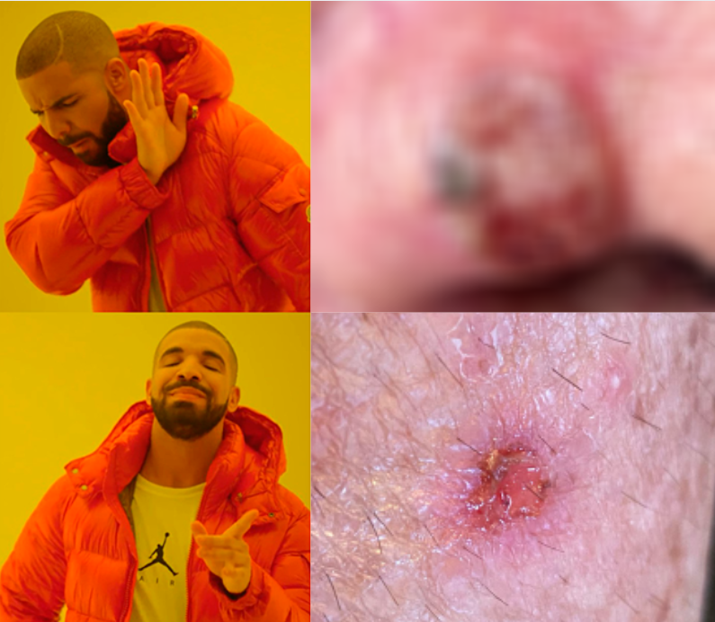

# Avaliação da Qualidade de Imagens de Lesões de Pele 🔎🖼️

Olá, sejam bem-vindos ao repositório! O trabalho desenvolvido é referente à classificação da qualidade de imagens de lesões de pele utilizando técnicas de aprendizado de máquina. Essa avaliação é muito importante para a montagem de um bom dataset visando o treinamento de modelos para classificação das lesões. A seguir, vocês verão todas as instruções necessárias para utilizar o repositório.

<div align="center">
  
</div>

## 📒 Dataset
O classificador vai avaliar a qualidade da imagem em duas classes: boa ou ruim. Para avaliar as imagens é necessário ter um dataset com a seguinte estrutura de pastas:
```
dataset/
├── boa/
│ ├── img1_boa.png
│ ├── img2_boa.png
│ └── ...
├── ruim/
│ ├── img1_ruim.png
│ ├── img2_ruim.png
│ └── ...
└──
```
Boa parte das imagens utilizadas para o treinamento foram obtidas do dataset do [PAD-UFES-20](https://data.mendeley.com/datasets/zr7vgbcyr2/1), caso tenham interesse.

## Raug
Este repositório utiliza o [Raug](https://github.com/paaatcha/raug), pipeline de treinamento de modelos para redes neurais. Para entender melhor seu funcionamento acesse seu repositório.

## ⚙️ Configurações
Para utilizar o repositório é necessário criar um arquivo de configuração `config.json`:
```json
{
  "raug_full_path": "path/to/raug",
  "dataset_full_path": "path/to/dataset",
  "save_folder_full_path": "path/to/save_folder"
}
```

## 💻 Como executar?
O repositório utiliza a biblioteca [Sacred](https://sacred.readthedocs.io/en/latest/quickstart.html) para executar experimentos. Veja na documentação para entender melhor seu funcionamento. Para executar os experimentos neste repositório, a utilização do básico da biblioteca é o suficiente. Um exemplo de execução é:
```bash
python main.py with _model="resnet" _lr_init=0.0001
```
Todos os possíveis parâmetros e seus valores estão descritos em `main.py`.

## 📈 Resultados e avaliação dos experimentos
Para cada experimento realizado é criada uma pasta na raiz do diretório `"save_folder_full_path"`, indicado no `config.json`. Dentro da pasta, são exibidos resultados para cada folder da validação cruzada, além das métricas agregadas. São salvos gráficos, curvas, métricas e logs de cada experimento.

## 🖌️ Geração de imagens deterioradas
Também é disponibilizado um notebook com um pipeline para geração de imagens deterioradas, com a aplicação de blur, em [image_process](./preprocess/image_process.ipynb). Todas as orientações para utilização estão descritas no notebook.
